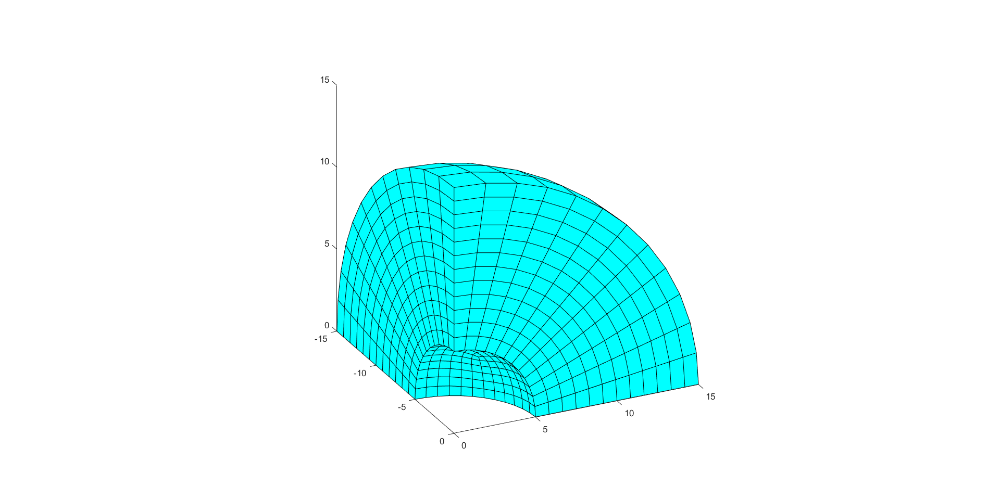
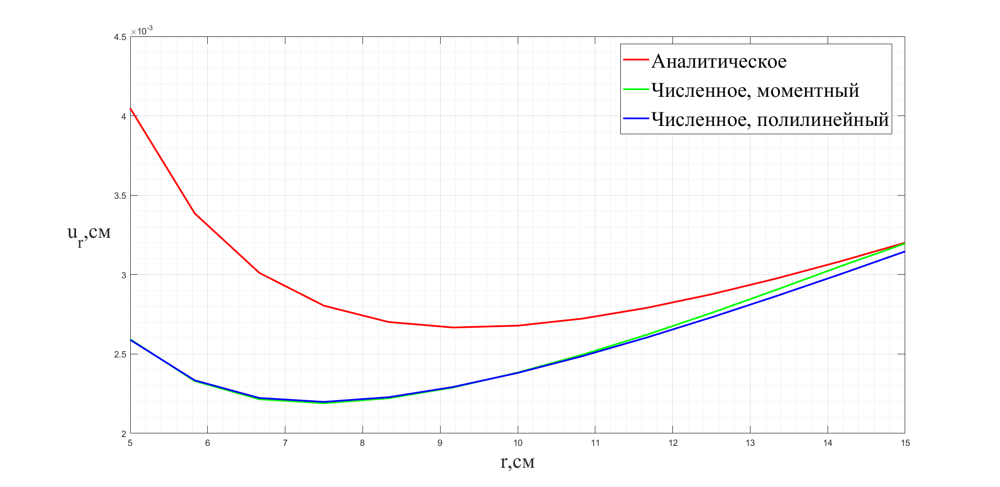
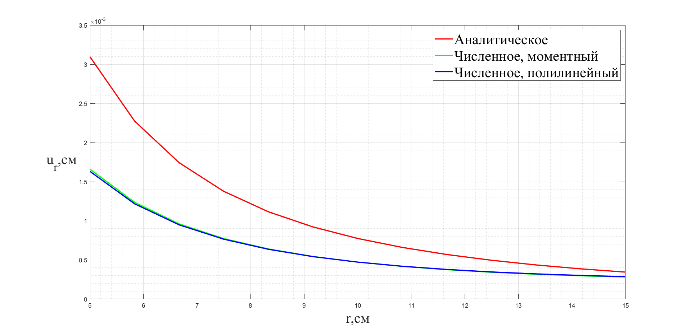

# Задача о полой сфере, нагруженной внешним и внутренним давлением

Пусть задано бесконечное упругое изотропное пространство, в котором находится сферическая полость радиуса \(a\). При наличии сферической симметрии перемещения \(u\) направлены вдоль радиусов и зависят только от расстояния точки до центра симметрии. Радиальные перемещения, удовлетворяющие уравнениям Ламе, имеют следующий вид:

$$u_{r} = C_{1}r + \frac{C_{2}}{r^{2}}$$

где \(C_{1}, C_{2}\) — некоторые постоянные. Компоненты напряжений в сферических координатах запишутся через те же постоянные:

$$\sigma_{rr} = 3KC_{1} - \frac{2C_{2}\mu}{r^{3}}$$

$$\sigma_{\varphi\varphi} = \sigma_{\psi\psi} = 3KC_{1} + \frac{C_{2}\mu}{r^{3}}$$

где величина \(K = \lambda + \frac{2}{3}\mu\) называется объёмным модулем упругости.

## Описание расчётной модели

Будем решать задачи в декартовых координатах \((x,y,z)\), а результат представлять в сферических координатах \((r,\varphi,\psi)\). Расчётная сетка представляет собой восьмую часть сферы радиуса \(R = 15\) см с полостью радиуса \(a = 5\) см в центре. Граничные условия — на плоскостях \(x = 0, y = 0, z = 0\) условия симметрии.

### Рис. 4.1. Сетка конечных элементов для полой сферы

Материал принят изотропным, линейно-упругим, модуль Юнга \(E = 210\) ГПа, коэффициент Пуассона \(\nu = 0.3\). Будем использовать моментный элемент с параметром \(\xi = 1\) и полилинейный конечные элементы.

## Задача о концентрации напряжений около сферической полости

Пусть напряженное состояние стремится к одноостному растяжению \(\sigma_{\infty} = 100\) МПа в отдалении от полости \((r \rightarrow \infty)\), поверхность полости свободна от напряжений. Получим граничные условия через радиальную компоненту напряжений:

$$\sigma_{rr}(a) = 3KC_{1} - \frac{2C_{2}\mu}{a^{3}} = 0$$

$$\sigma_{rr}(\infty) = 3KC_{1} = \sigma_{\infty}$$

Отсюда получим постоянные \(C_{1}, C_{2}\):

$$C_{1} = \frac{\sigma_{\infty}}{3K}, \quad C_{2} = \frac{a^{3}\sigma_{\infty}}{2\mu}$$

Перемещения и компоненты напряжений запишутся в следующем виде:

$$u_{r}(r) = \sigma_{\infty}\left( \frac{r}{3K} + \frac{a^{3}}{2\mu r^{2}} \right)$$

$$\sigma_{rr}(r) = \sigma_{\infty}\left( 1 - \frac{a^{3}}{r^{3}} \right)$$

$$\sigma_{\varphi\varphi}(r) = \sigma_{\psi\psi}(r) = \sigma_{\infty}\left( 1 + \frac{a^{3}}{2r^{3}} \right)$$

Напряжение достигает максимального значения на поверхности сферической полости:

$$\sigma_{\max} = \sigma_{\varphi\varphi}(a) = 1.5\sigma_{\infty}$$

Сравним перемещения вдоль радиусов, полученные аналитически и численно, а также найдём коэффициент концентрации напряжений.

### Рис. 4.2. Перемещения узлов вдоль радиуса

Перемещения узлов в отдалении от сферической полости для моментных элементов сходятся к аналитическим. Для полилинейных элементов сходимость более медленная, что свидетельствует о наличии объёмного запирания.

Коэффициент напряжения, вычисленный по моментной схеме, равен 1.4849, относительная погрешность равна 0.010.

Коэффициент напряжения, вычисленный по полилинейной схеме, равен 1.4494, относительная погрешность равна 0.034.

## Задача о центре расширения

Пусть в бесконечное упругое пространство вставлена абсолютно жёсткая сфера радиусом \(a\). Объём этой сферы увеличился на \(\Delta V\). Пусть \(C_{1} = 0\), то есть бесконечно далёкие узлы не перемещаются. Смещение узлов на поверхности сферы:

$$u_{r} = \frac{C_{2}}{a^{2}} = \frac{\Delta V}{4\pi a^{2}} \rightarrow C_{2} = \frac{\Delta V}{4\pi}$$

Напряжения в упругом пространстве:

$$\sigma_{rr}(r) = -\frac{\Delta V\mu}{2\pi r^{3}}$$

$$\sigma_{\varphi\varphi}(r) = \frac{\Delta V\mu}{4\pi r^{3}}$$

Расширение жёсткой сферы и её давление на упругое пространство будем задавать давлением на внутреннюю поверхность сферы. Значение давления \(P\) найдём из граничных условий на напряжения:

$$P = \frac{\Delta V\mu}{2\pi a^{3}}$$

### Рис. 4.3. Перемещения узлов вдоль радиуса

## Качество сетки

Можно заметить, что аналитические напряжения не доходят до значений заданных давлений. Для данной сетки отношение внутреннего радиуса к внешнему слишком велико, чтобы разумно моделировать задачу
