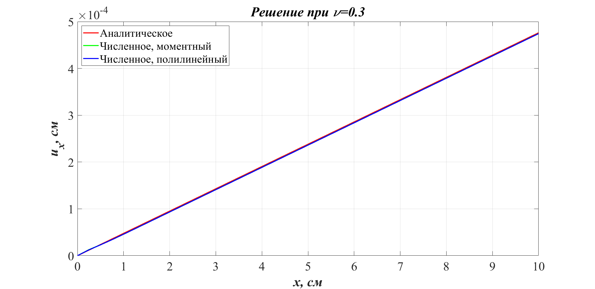
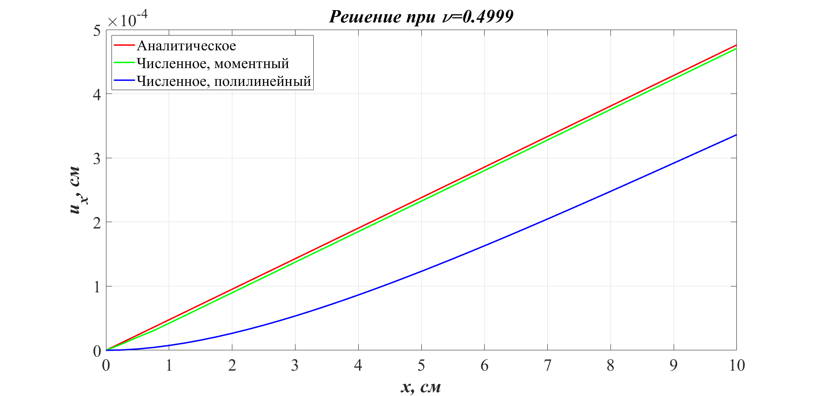
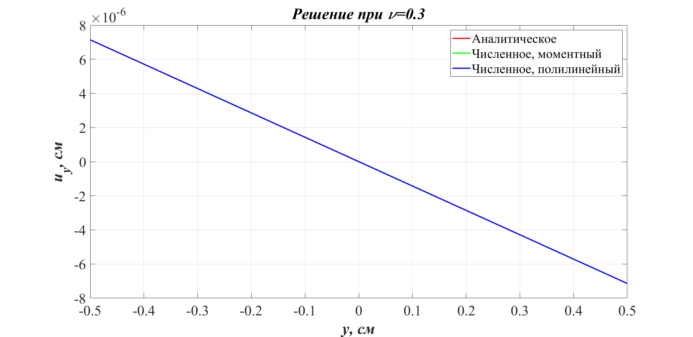
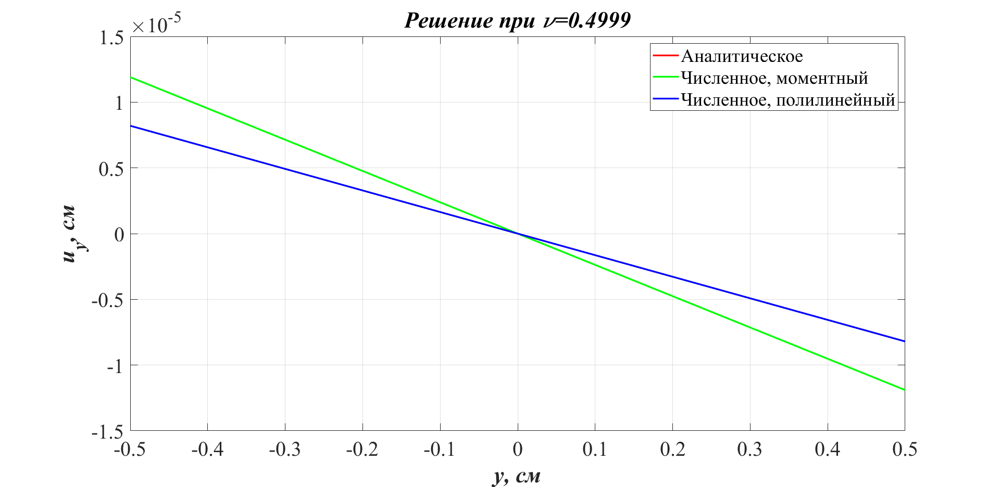

# Одноостное растяжение бруса

Прямоугольный брус размером $[Lx \times Ly \times Lz] = [10 \text{ см} \times 1 \text{ см} \times 1 \text{ см}]$, одна грань которого полностью защемлена $(x = 0 \text{ см})$, растягивается равномерно распределённой нагрузкой $P = 10 \text{ МН/см}^{2}$ в направлении $0X$, приложенной к грани, противоположной защемленной $(x = 10 \text{ см})$. Материал принят изотропным, линейно-упругим, модуль Юнга $E = 210 \text{ ГПа}$, коэффициент Пуассона $\nu$.

## Напряжения в брусе

В брусе возникает постоянное напряжение:

$$\sigma_{xx} = P$$

$$\sigma_{yy} = \sigma_{zz} = \sigma_{xy} = \sigma_{yz} = \sigma_{xz} = 0$$

## Деформации

и постоянные деформации:

$$\varepsilon_{xx} = \frac{P}{E}$$

$$\varepsilon_{yy} = \varepsilon_{zz} = -\frac{\nu P}{E}$$

$$\varepsilon_{xy} = \varepsilon_{yz} = \varepsilon_{xz} = 0$$

## Поля перемещений

Пусть начало координат находится в центре защемлённой грани. Поля перемещений будут линейными:

$$u_{x} = \varepsilon_{xx} \cdot x$$

$$u_{y} = \varepsilon_{yy} \cdot y$$

$$u_{z} = \varepsilon_{zz} \cdot z$$

## Численное решение

Для численного решения будем использовать моментный элемент с параметром ξ=1 и полилинейный конечные элементы.

Рассмотрим компоненты перемещения $u_{x}$, $u_{y}$, полученные аналитически и численно при различных значениях коэффициента Пуассона:

### Рис. 4.1. Перемещение вдоль $0X$, коэффициент Пуассона 0.3

### Рис. 4.2. Перемещение вдоль $0X$, коэффициент Пуассона 0.4999

### Рис. 4.3. Перемещение вдоль $0Y$, коэффициент Пуассона 0.3

### Рис. 4.4. Перемещение вдоль $0Y$, коэффициент Пуассона 0.4999

## Объёмное запирание

При обычном для сталей коэффициенте Пуассона все решения близки. Небольшие возмущения присутствуют рядом с защемлённым концом, там нарушена однородность поля деформаций. Однако, решение остаётся устойчивым, погрешность постоянна.

Для сред, близких к несжимаемым, ситуация качественно другая. Полилинейный конечный элемент демонстрирует заниженные перемещения, жёсткость сильно завышена. Это проявления объёмного запирания в элементах. Решение для моментного элемента остается близким к аналитическому. Это показывает, что моментный элемент не проявляет нежелательного эффекта объёмного запирания.